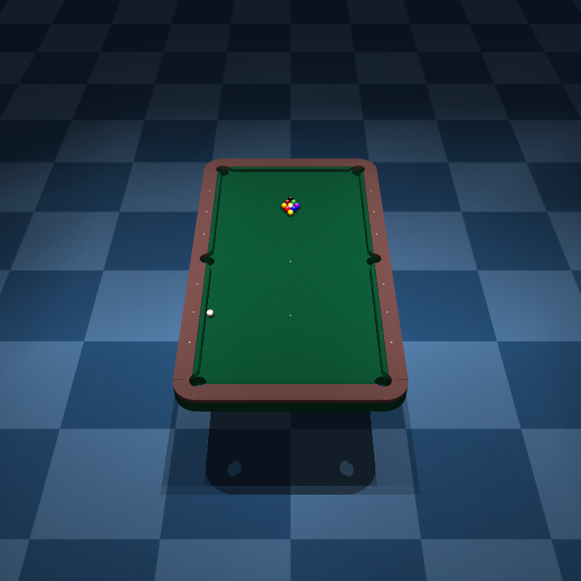
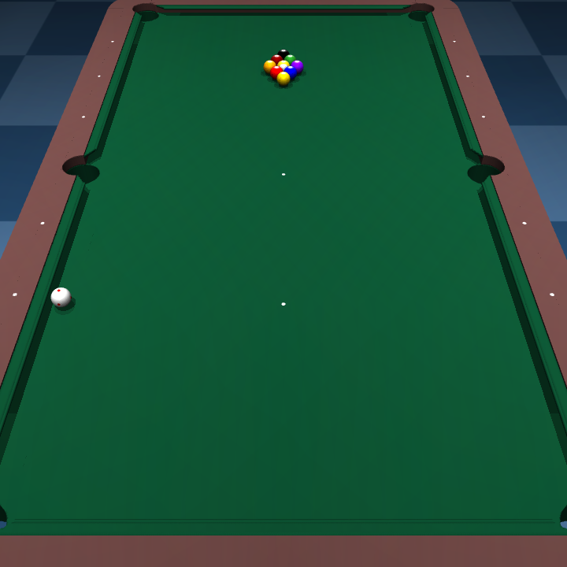
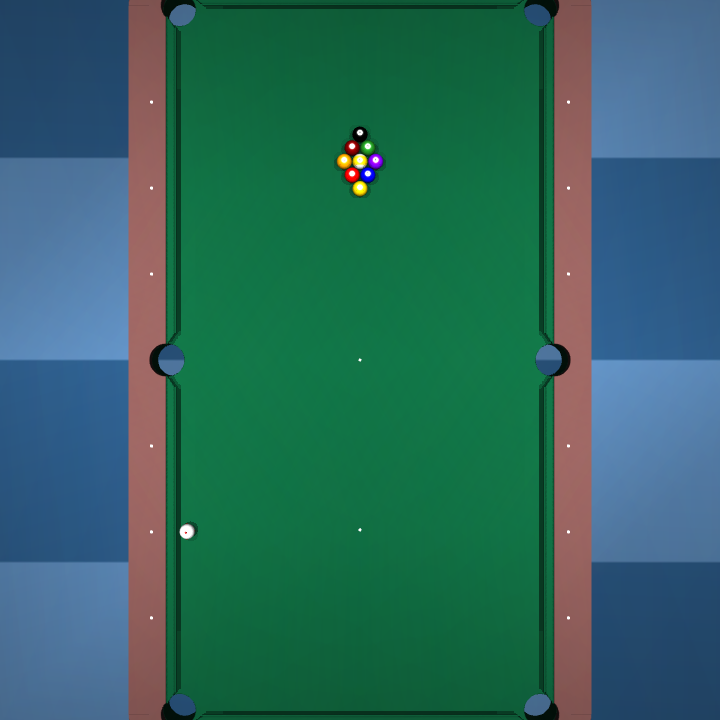

# MuJoCo Billiards MJCF

This repository contains high-fidelity MuJoCo MJCF models for a pocket billiards (pool) table and balls.
It uses custom Signed Distance Field (SDF) plugins to accurately simulate the complex geometry of the table, including the pocket openings and the cushion profiles.



<p align="center">
  
  
</p>

## Demo Video

You can watch the simulation in action on YouTube Shorts:

[](https://www.youtube.com/shorts/gdgRgan6nv8)

*(Click the image above to watch the video on YouTube)*

## Features

- **Realistic Geometry**: Pocket openings and cushions are modeled using custom SDF plugins for precise contact dynamics.
- **Accurate Physical Parameters**: Ball dimensions (57 mm), mass (165 g), and contact parameters are set to match standard pool balls.
- **Preconfigured Scenarios**:
  - `one-ball.xml`: A simple setup with a cue ball and the 9-ball for banking and contact testing.
  - `nine-ball.xml`: A complete Nine-ball rack setup, ready for break shots.
  - `balls.xml`: A showcase layout containing all 15 object balls and the cue ball.
- **High-Quality Textures**: Includes billiard ball textures (1 to 15) and a green cloth texture.

## Directory Structure

- `billiard-table-definitions.xml`: Defines the table geometry, pockets, and cushions.
- `ball-definitions.xml`: Contains definitions for the balls, including textures, materials, and physical properties.
- `one-ball.xml`: Action-ready model with the cue ball and the 9-ball.
- `nine-ball.xml`: Model representing a standard Nine-ball game setup.
- `balls.xml`: Utility model to preview all billiard balls.
- `sdf/`: Source code for the custom SDF plugins.
- `img/`: Texture images for the balls and the table surface.

## Setup Instructions

To run these models, you must build and install MuJoCo from source with the custom SDF plugins included in this repository.

### 1. Build MuJoCo from Source

Please refer to the official [MuJoCo Build Guide](https://mujoco.readthedocs.io/en/stable/programming/index.html#building-from-source) for details.

1. Download the MuJoCo source code from the [MuJoCo Releases Page](https://github.com/google-deepmind/mujoco/releases).
2. Extract the downloaded source code archive to a directory of your choice (e.g., `/usr/local/src/mujoco-X.Y.Z`).
3. Replace or integrate the SDF plugin code.
   Rename the existing `plugin/sdf/` directory in the MuJoCo source to `sdf.bak`.
   Then, copy the `sdf/` directory from this repository to `plugin/sdf/` in the MuJoCo source tree.
4. Build and install MuJoCo by running the following commands (assuming `/opt/mujoco-X.Y.Z` as the installation directory):

   ```bash
   cd /usr/local/src/mujoco-X.Y.Z
   mkdir build
   cd build
   cmake ..
   cmake --build .
   cmake .. -DCMAKE_INSTALL_PREFIX=/opt/mujoco-X.Y.Z
   sudo cmake --install .
   ```

### 2. Copy Plugin Libraries

The default install command might not copy the plugin libraries.
If you experience issues with plugins not loading, copy them manually as follows:

```bash
cd /opt/mujoco-X.Y.Z/bin/
sudo mkdir mujoco_plugin
cd mujoco_plugin/
sudo cp /usr/local/src/mujoco-X.Y.Z/build/lib/libactuator.so .
sudo cp /usr/local/src/mujoco-X.Y.Z/build/lib/libelasticity.so .
sudo cp /usr/local/src/mujoco-X.Y.Z/build/lib/libsdf_plugin.so .
sudo cp /usr/local/src/mujoco-X.Y.Z/build/lib/libsensor.so .
```

If you are using MuJoCo Python bindings, copy the built plugin library to your python environment:

```bash
cp /usr/local/src/mujoco-X.Y.Z/build/lib/libsdf_plugin.so path/to/python3.11/site-packages/mujoco/plugin/
```

## How to Run

After setting up the plugins, you can visualize the models using the MuJoCo `simulate` tool.

```bash
# To run the Nine-ball scenario
/opt/mujoco-X.Y.Z/bin/simulate nine-ball.xml

# To run the One-ball scenario
/opt/mujoco-X.Y.Z/bin/simulate one-ball.xml
```

## License

This project is licensed under the MIT License - see the [LICENSE](LICENSE) file for details.
